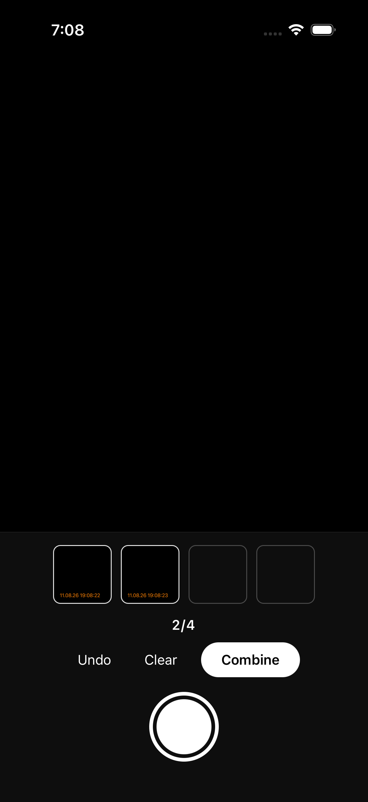
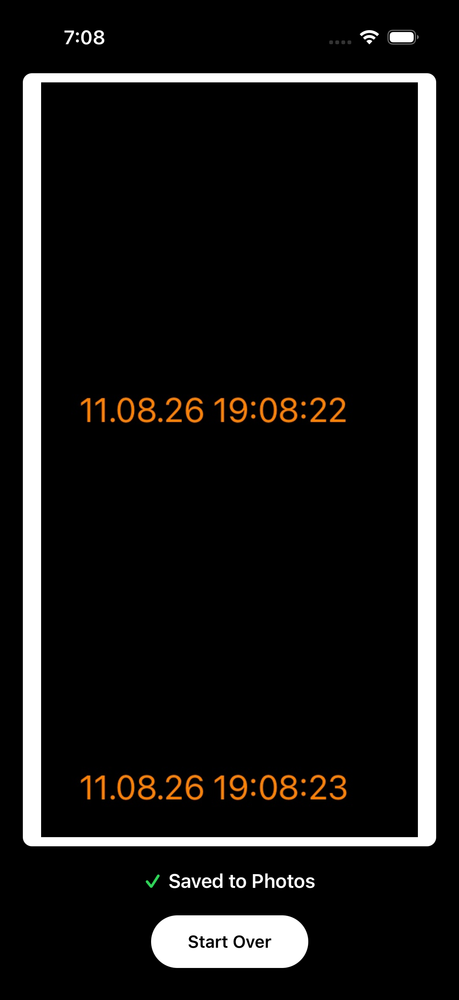
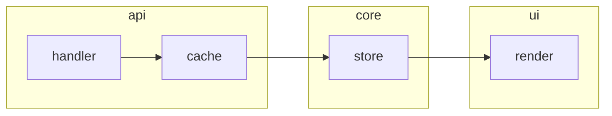

<div class="kicker">An example and guide · For vibe coders / low-code engineers</div>

# Loop<br><span class="accent">Engineering</span>

<div class="rule-accent"></div>

<p class="muted" style="font-size:1.2rem; max-width:46ch; margin-bottom:0">
  Think in loops, not prompts — software that ships <strong>while you sleep</strong>: state on disk, roles separated, contract before code.
</p>

<div class="foot-tag">Loop Engineering · press → to begin</div>

<!--
Opening beat: this is a workflow talk, not a tool talk. Promise the room one
boring, verifiable loop they could run on Monday. Read the subtitle as the
three moves — state, roles, contract — the whole deck hangs on them. The
"while you sleep" line is aspiration, not a claim we will defend. Skip: any
framework name-dropping; the contrast gets one slide later, on our terms.
-->

---

<div class="kicker">The exhibit</div>

## Quick Shutter, in numbers

<div class="cardrow cols-3">
  <div class="card"><div class="ct">THE APP</div><h4>Snap → collage</h4><p>Open, snap up to 4, combine — saved to Photos.</p></div>
  <div class="card"><div class="ct">SCOPE</div><h4>10 features</h4><p>Spec'd, built, done — all-green.</p></div>
  <div class="card"><div class="ct">PROOF</div><h4>30 mechanical assertions</h4><p>Every claim is a command anyone can run.</p></div>
</div>

<div style="display:grid; grid-template-columns:1fr auto; gap:2rem; align-items:center; margin-top:1rem">
<div>

<p v-click class="callout" style="font-size:1.12rem">
  50 commits · 7.2 days, part-time · 2026-08-04 → 2026-08-11 — every number on this slide <span class="accent">can be checked against the repo yourself</span>.
</p>

</div>
<div>

<div style="display:flex; gap:0.5rem; align-items:flex-start">
  
  
</div>
<p class="muted" style="font-family:'JetBrains Mono', monospace; font-size:0.66rem; margin:0.3rem 0 0; text-align:right; max-width:30em">
  simulator previews — the camera shows a test pattern; the app around it is what shipped
</p>

</div>
</div>

<!--
Quick Shutter is a real single-user tool, human-verified on device: photos in,
orientation fixed, one collage out. The two phone shots are simulator previews
from the D1 gate — the camera counter reads 2 of 4, and the result screen has
just saved to Photos. Be honest about them: the picture content is a test
pattern; what shipped is the app around it. Every figure comes from the
repo itself — the feature queue, the locked contract's status header, git log
over the build window. Say: none of these numbers are my opinion; you can
re-derive all of them. Skip: the app's internals — it is the evidence, not
the subject.
-->

---

<div class="kicker">Why loops</div>

## The prompt runs once; the loop repeats

<div class="cardrow cols-2">
  <div class="card"><div class="ct">THE PROMPT</div><h4>One shot, then scrollback</h4><p>Every message re-explains the project, and the work lives in a conversation that eventually scrolls away.</p></div>
  <div class="card"><div class="ct">THE LOOP</div><h4>gather → reason → act → verify</h4><p>Every pass re-reads state from disk and writes its result back, so you iterate on the harness — prompts and roles included — through traces, not chat.</p></div>
</div>

<p v-click class="callout" style="margin-top:1.8rem">
  In my experience, the saving isn't a smarter model — it is <span class="accent">never explaining the project twice</span>.
</p>

<!--
Contrast beat: the prompt is a transaction, the loop is a process. Say: all the
expensive parts of re-prompting — re-explaining the codebase, re-establishing
conventions — the loop pays once, because state lives on disk and each pass
re-derives what it needs. When something goes wrong you read the trace, fix the
prompt or the role, and every later run inherits the fix. If the token question
comes up: one loop pass can out-spend a one-shot prompt — the saving is not
per-pass token counts, it is the runs you never waste: no re-explaining the
project, no re-doing work a stale prompt misread. The honest-cost slide near
the end carries the real accounting. Skip: war stories — they get a whole
section later.
-->

---

<div class="kicker">Why loops</div>

## Boring on purpose

<div class="cardrow cols-2">
  <div class="card"><div class="ct">WHAT IT ISN'T</div><h4>An orchestration framework</h4><p>Brokers, DAG editors, retry DSLs, dashboards — another system to learn, debug, and trust before your first loop even runs.</p></div>
  <div class="card"><div class="ct">WHAT IT IS</div><h4>A while-loop, markdown, an exit code</h4><p>Agile, rediscovered: working software every iteration; inspect and adapt — the traces are the retrospective; human gates are the review.</p></div>
</div>

<p v-click class="callout" style="margin-top:1.8rem">
  The boringness is the feature: every piece of the harness is a file you can <span class="accent">search, compare, and roll back — one person can audit it in one sitting</span>.
</p>

<!--
Preempt the "why not a real agent framework" question. What frameworks add is
real machinery — brokers, DAG editors, retry DSLs, dashboards — and the cost
is another system to learn, debug, and trust before your first loop runs.
Our answer is deliberate smallness: the whole engine is a while-loop over
markdown files and an exit code. Say the quiet part plainly: boring equals
auditable — every piece of the harness is a file you can search, compare,
and roll back, and one person can audit the whole thing in one sitting.
Then map it to what the room already
believes: working software every iteration, inspect and adapt, human gates
as review. Exit codes, if asked: 0 is pass, non-zero is fail — grep exits
1 on no match, and suites exit non-zero on any failure. The loop only
needs the binary verdict: it turns any tool into a mechanical check.
Skip: framework names entirely — feature-comparing them is a
stated non-goal.
-->

---

<div class="kicker">Why loops</div>

## You already know this discipline

<div class="cardrow cols-3">
  <div class="card"><div class="ct">STATE ON DISK</div><h4>Persistence, recovery</h4><p>A crashed run costs one pass, not the project — the next one re-reads the files and carries on.</p></div>
  <div class="card"><div class="ct">ROLES SEPARATED</div><h4>Separation of concerns</h4><p>Planner, generator, evaluator: one worry each. Swap a model or fail a role without contagion.</p></div>
  <div class="card"><div class="ct">CONTRACT BEFORE CODE</div><h4>Spec-first, test-first</h4><p>The checks are agreed before the first line exists — and they outlive every rewrite.</p></div>
</div>

<p v-click class="callout" style="margin-top:1.8rem">
  Good ol' software engineering, <span class="accent">aimed at the agents</span>.
</p>

<!--
Landing beat for the section: reframe the cover's three moves as plain software
engineering. State on disk is persistence and failure recovery — a dead run
costs one pass. Roles separated is separation of concerns — swap the model,
keep the structure. Contract before code is spec- and test-first — the checks
predate the code and outlive rewrites. If the room keeps one thing: they already
run this discipline; the loop just points it at agents. Skip: implementation —
next section shows the actual folder.
-->

---

<div class="kicker">Anatomy of a loop</div>

## The state layer is a folder

<div class="grid grid-cols-2 gap-10" style="margin-top:0.4rem; align-items:start">
<div>

<p style="font-size:1.15rem; margin-top:0">
  Everything the loop knows, it re-reads from disk: <strong>queue, contract, progress</strong> — a crashed run loses one pass, never the project.
</p>

<p v-click class="callout" style="font-size:1.15rem; margin-top:1.6rem">
  This deck's own folder (<strong>sharing_slides/</strong>) has the same shape — <span class="accent">the reveal comes last</span>.
</p>

</div>
<div>

<div class="card" style="border:1px solid var(--ink); font-size:13px; line-height:1.45">
<div class="ct" style="margin-bottom:0.5rem">quick_shutter/ — THE APP REPO, LIVE</div>

```
quick_shutter/
├── SPEC.md            # the idea
├── PLAN.md            # phases, gates
├── contract.md        # done = checks
├── feature_list.json  # the queue
├── progress.md        # next + blockers
├── log.md             # history
├── rubric.md          # taste
├── prompts/           # role jobs
├── research/          # inputs
├── traces/            # transcripts
├── loop.sh            # build
├── eval.sh            # grade
└── … plus the app: src/, modules/, ios/, maestro/ …
```
</div>

</div>
</div>

<!--
The exhibit is the real thing now: Quick Shutter's repo root, listed as it
sits on disk — the loop's own files annotated, the app payload elided below
the line. Walk the loop files: the queue says what is next, the contract
says what done means, progress and log let any fresh session resume — a
crash costs one pass, not the project. Point at the right column while
saying this. This deck's own folder (sharing_slides) has the same shape;
that reveal is saved for the end, and the engine scripts you are looking at
get quoted verbatim in two slides. Skip: file-by-file commentary — the
shape is the argument.
-->

---

<div class="kicker">Anatomy of a loop</div>

## Three roles, two model families

<table class="mini" style="margin-top:0.8rem">
  <thead><tr><th>Role</th><th>Model</th><th>Why</th></tr></thead>
  <tbody>
    <tr><td>Planner</td><td>Kimi K3</td><td>long-horizon reasoning</td></tr>
    <tr><td>Generator</td><td>Kimi K3</td><td>long unattended coding runs</td></tr>
    <tr><td>Code evaluator</td><td>GLM-5.2</td><td>different family — no self-grading</td></tr>
    <tr><td>Visual evaluator</td><td>Kimi K3</td><td>native vision, screenshot review</td></tr>
  </tbody>
</table>

<p v-click class="callout" style="margin-top:1.6rem">
  A model never grades its own work — the evaluator sits in a <span class="accent">different model family</span>, so agreement has to be earned.
</p>

<!--
Separation of concerns, instantiated. Kimi K3 holds three jobs — planning,
generating, reviewing screenshots — while GLM-5.2 grades the code from a
different model family, so no grade is self-grading. Say: this is an org
chart decision, not a prompting trick; family distance is the cheapest
anti-sycophancy device we found. Skip: benchmarks and pricing — they rot,
and they are not the point.
-->

---

<div class="kicker">Anatomy of a loop</div>

## The engine, verbatim

<div class="card" style="border:1px solid var(--ink); margin-top:0.2rem; padding:0.55rem 0.9rem; font-size:12.5px; line-height:1.32">
<div class="ct" style="margin-bottom:0.22rem">loop.sh · HUMAN-LAUNCHED</div>

```bash
#!/bin/bash
# The build while-loop (PLAN.md Phase 3). Do not run before Phase 3.
while ! grep -qx "DONE" progress.md; do
  ts=$(date +%Y%m%d-%H%M%S)
  kimi -p "$(cat prompts/generator.md)" > "traces/${ts}-generator.log" 2>&1
  sleep 10
done
```

<p style="font-family:'JetBrains Mono', monospace; font-size:0.75rem; color:var(--muted); margin:0.25rem 0 0">once per build session — unattended until DONE</p>
</div>

<div class="card" style="border:1px solid var(--ink); margin-top:0.3rem; padding:0.55rem 0.9rem; font-size:12.5px; line-height:1.32">
<div class="ct" style="margin-bottom:0.22rem">eval.sh · EVALUATOR-RUN</div>

```bash
#!/bin/bash
# The evaluation pass (PLAN.md Phase 4). Do not run before Phase 4.
# Prerequisite: GLM provider configured in Kimi Code config.toml ([providers.zai]
# + [models."zai/glm-5.2"]) — that setup happens before Phase 2, not in Phase 0.
ts=$(date +%Y%m%d-%H%M%S)
kimi -m "zai/glm-5.2" -p "$(cat prompts/evaluator.md)" > "traces/${ts}-evaluator.log" 2>&1
```

<p style="font-family:'JetBrains Mono', monospace; font-size:0.75rem; color:var(--muted); margin:0.25rem 0 0">after build iterations — never the generator</p>
</div>

<!--
Read loop.sh aloud — it fits in your head: until progress.md ends with DONE,
run the generator and keep the transcript. Who runs what: the human or the
planner launches the build loop once per session and then leaves it alone;
eval.sh belongs to the evaluator role, run after build iterations or on
demand — the generator never grades its own work, which is the next slide's
whole point. These are Quick Shutter's exact scripts, pasted unmodified —
you just saw their folder. This deck's variant swaps the runner command and
nothing else. Skip: bash trivia — the point is there is nothing here to
break.
-->

---

<div class="kicker">Anatomy of a loop</div>

## Working agreements, human gates

<div class="cardrow cols-2">
  <div class="card"><div class="ct">PROMPTS ARE WORKING AGREEMENTS</div><h4>Written jobs, not vibes</h4><p>Each role gets a file — fix the file, and every later run inherits it.</p><p class="quote">"Done means a check tied to a specific contract.md line passes." · "If 200 lines could be 50, rewrite it."</p></div>
  <div class="card"><div class="ct">HUMANS OWN THE RISKY SLICE</div><h4>Gates, not supervision</h4><p>The boring bulk runs while nobody watches; the risky slice asks first.</p><p class="quote">"Any contract.md edit · New dependency installs · Publishing"</p></div>
</div>

<p v-click class="callout" style="margin-top:1.8rem">
  The prompt is code — <span class="accent">version it, diff it, fix it where the trace went wrong</span>.
</p>

<!--
Governance closes the anatomy. Prompts are working agreements under version
control, and the quotes on this slide are lifted verbatim from the harness's
own prompt files — anyone can open them in the repo and read their team's
contract. The traces name the exact line that lied — so you tune the
harness, not your luck. The human gate list is deliberately tiny: contract
edits, installs, publishing — the risky slice gets a person, the boring bulk
runs while nobody watches, and that is where the cover's "while you sleep"
is actually earned. Skip: reading the full gate list aloud; the three on
screen carry it.
-->

---

<div class="kicker">The contract</div>

## Agree on done, before code

<div class="cardrow cols-3">
  <div class="card"><div class="ct">GENERATOR</div><h4>Proposes the checks</h4><p>Every claim pinned as a command, an exit code, a grep — never a judgment call.</p></div>
  <div class="card"><div class="ct">EVALUATOR</div><h4>Attacks the draft</h4><p>Dry-runs every assertion against the repo; vague or wrong checks bounce with evidence.</p></div>
  <div class="card"><div class="ct">HUMAN</div><h4>Arbitrates, locks</h4><p>Deadlocks and every edit after lock are human gates. Each round is dated prose on disk.</p></div>
</div>

<div style="margin-top:1.2rem">
  <span class="pill">Build</span>
  <span class="pill">Content</span>
  <span class="pill">Fact pins</span>
  <span class="pill">Visual</span>
</div>

<p v-click class="callout" style="margin-top:1.4rem">
  Quick Shutter's contract locked <span class="accent">30 mechanical assertions across four shapes</span> — before the build loop ran once.
</p>

<!--
Mechanics beat: the contract is negotiated the way code is reviewed. The
generator drafts checks that a script can decide — a command, an exit code,
a grep. The evaluator attacks the draft by dry-running it against the repo,
not by arguing taste. The human only arbitrates deadlocks and owns the lock.
Say: every negotiation round is dated prose inside the contract file — the
argument itself is state on disk. Skip: this deck's own negotiation story —
that reveal is saved for the end.
-->

---

<div class="kicker">The contract</div>

## Caught before the code existed

<div class="cardrow cols-2">
  <div class="card"><div class="ct">S1 · NEGOTIATION ROUND 1</div><h4>Jest can't call native modules</h4><p>Unit checks were pinned against native IO. Fix: test pure functions instead, and replace the phone's hardware with fakes for the test (mocking). A side effect: the architecture got cleaner for free.</p></div>
  <div class="card"><div class="ct">S5 · NEGOTIATION ROUND 2</div><h4>Maestro has no assertEnabled</h4><p>Asserting a button's enabled state isn't mechanical there. Fix: tap and observe — counter still 0/4, camera screen unchanged, no navigation.</p></div>
</div>

<p v-click class="callout" style="margin-top:1.8rem">
  Both landed as <span class="accent">review comments on a contract draft</span> — the harness got patched, not the app.
</p>

<!--
Two catches from the negotiation rounds, both dated 2026-08-06 in the repo's
contract file. S1: Jest cannot call native modules, so the unit checks were
rewritten against pure functions with mocked dependencies — the evaluator's
own words: this also forces a cleaner architecture. S5: Maestro has no
assertEnabled core command, so enabled-state assertions became tap-and-observe
checks a script can decide. The framing to sell: these are code-review
comments that arrived before the code — the cheapest bugs you will ever
not write. Skip: the assertion IDs beyond S1/S5; the stories carry it.
-->

---

<div class="kicker">The contract</div>

## S20 — the check that would pass anyway

<div class="grid grid-cols-2 gap-10" style="margin-top:0.4rem; align-items:start">
<div>

<p style="font-size:1.15rem; margin-top:0">
  Amendment 5 pinned pinch zoom as a pure function with a <strong>multiplicative</strong> formula — and the launch state at exactly 0.
</p>

<p style="font-size:1.15rem; margin-top:1rem">
  Under multiplication, 0 is absorbing — zero times anything is zero. No pinch, ever, could move the zoom.
</p>

<p v-click class="callout" style="font-size:1.15rem; margin-top:1.4rem">
  The check would sit <span class="accent">green in CI while the feature was dead on arrival</span> — caught before a line of zoom code existed.
</p>

</div>
<div>

<div class="card" style="border:1px solid var(--ink); font-size:13px; line-height:1.5">
<div class="ct" style="margin-bottom:0.5rem">THE MATH, AS PINNED</div>

```
nextZoom(base, scale) = clamp(base × scale, 0, 1)

launch state: zoom = 0   (not zoomed)

0 × s = 0, for every s
→ zoom stays 0, forever
```

<p style="font-size:0.95rem; margin-bottom:0">Fix, before lock: additive — <code>clamp(base + (scale − 1), 0, 1)</code> — operable from 0.</p>
</div>

</div>
</div>

<!--
The strongest catch, and it is math, not tooling. The zoom formula multiplied;
the pinned launch state was 0; zero times anything is zero — so the feature
was unreachable from its own default, while the check testing the formula
stayed green forever. The evaluator verified in node that 0*2.5 === 0, and
verified no zoom code existed yet — a negotiation-time fix, not a hotfix.
Bonus honesty beat, if asked: the absorbing identity case was first pinned
in BY the evaluator's own earlier round — the attack process caught its own
error. Skip: the dyadic IEEE-754 details in the amendment; the formula on
screen is the whole story.
-->

---

<div class="kicker">War stories</div>

## "The API ran" ≠ "the signal exists"

<div class="grid grid-cols-2 gap-10" style="margin-top:0.4rem; align-items:start">
<div>

<p style="font-size:1.15rem; margin-top:0">
  Path A scored OCR confidence at <strong>4 rotations</strong> and picked the highest score (the argmax). Its gate went green: OCR executes.
</p>

<p style="font-size:1.15rem; margin-top:1rem">
  First on-device walkthrough: Vision read clean text <strong>equally at every rotation</strong>. Orientation-agnostic on iOS 26.6. The argmax was rotating by noise.
</p>

<p v-click class="callout" style="font-size:1.15rem; margin-top:1.4rem">
  Feasibility must prove the <span class="accent">signal</span> exists, with a negative control (a case that should not detect the signal), on hardware. "The API returned a result" is not evidence.
</p>

</div>
<div>

<div class="card" style="border:1px solid var(--ink); font-size:13px; line-height:1.5">
<div class="ct" style="margin-bottom:0.5rem">THE PROBE · VISION OCR CONFIDENCE</div>

```
real capture   806 / 829 / 833 / 811
fixtures       35/35/35/35

→ flat across rotations
```

<p style="font-size:0.95rem; margin-bottom:0">Pivot: identity normalization. The probe data survived a wedged run — because state lives on disk.</p>
</div>

</div>
</div>

<!--
The biggest war story. The contract gate proved OCR runs on the simulator —
and that green masked the real question: does the orientation signal exist
at all. It does not; Vision on iOS 26.6 is orientation-agnostic, scoring
clean text near-equally at all four rotations and reading upside-down pixels
exactly, so argmax picked by noise. A human device walkthrough caught it,
not a check. Cost: the probe plus the pivot to identity normalization. The
lesson got written into the QS plan, human-approved: feasibility needs a
negative control on physical hardware. Skip: the iter numbers — the postmortem
carries them; the flat row on the right is the whole argument.
-->

---

<div class="kicker">War stories</div>

## iter 11b — DONE, past an open BLOCKER

<div class="cardrow cols-2">
  <div class="card"><div class="ct">WHAT THE RUN SAW</div><h4>DONE + an all-green queue</h4><p>Every feature shipped, the word DONE at the end of progress.md — so the generator did the polite thing and stopped.</p></div>
  <div class="card"><div class="ct">WHAT IT MISSED</div><h4>A blocker, further down</h4><p>The capture-EXIF fix still sat unresolved in the same file. The prompt ranked evaluator blockers above everything — and said nothing about its own.</p></div>
</div>

<p v-click class="callout" style="margin-top:1.8rem">
  One session burned to learn it. The prompt was patched mid-flight: <span class="accent">an open blocker outranks DONE</span>.
</p>

<!--
A self-inflicted war story, told against the harness. The run read DONE and
an all-green feature queue, politely stopped — and missed the unresolved
blocker section sitting further down the very same progress file, so a whole
session produced nothing. The fix was not code: the generator prompt gained
one rule, patched mid-flight, and this deck's own generator prompt carries
it today — open blocker sections outrank everything, including DONE. Say:
the traces made the failure legible, which is why it became a one-line fix
instead of a mystery. Skip: the EXIF bug's internals — the next slide's
machinery is the point here.
-->

---

<div class="kicker">War stories</div>

## C7 — the check that could never pass

<div class="cardrow cols-2">
  <div class="card"><div class="ct">THE DISCOVERY · BUILD ITER 6</div><h4>The simulator doesn't enforce denial</h4><p><code>simctl privacy deny photos</code> sets the privacy flag (TCC — the database iOS keeps permissions in) — PhotoKit still answers authorized, and the save succeeds. The app wasn't broken; the assertion was unpassable there.</p></div>
  <div class="card"><div class="ct">THE AMENDMENT · SIGNED IN 2 ROUNDS</div><h4>Split the check, keep the intent</h4><p>(a) Jest with a mocked denial covers the save-error branch in CI. (b) A manual on-device run verifies the real denial path, recorded in the log.</p></div>
</div>

<p v-click class="callout" style="margin-top:1.8rem">
  No unilateral edits: generator proposes, evaluator re-proves the premise, human authorizes — <span class="accent">the machinery held</span>.
</p>

<!--
The amendment machinery earning its keep. Discovered mid-build: the iOS
simulator does not enforce Photos denial for PhotoKit — the deny command
sets the flag, the authorization query still returns authorized, the save
succeeds. So C7 as written could never pass where it ran. The escape hatch:
a signed two-round mini-negotiation. The generator proposed the split; the
evaluator did not take its word — it re-ran the failing flow itself, read
the UI hierarchy, confirmed the premise; the human authorized. Mocked-denial
Jest branch for CI, manual on-device verification for the real path, intent
preserved, enforcement mechanism changed. Say: this is the standing pattern
for impossible checks — amend the contract, never quietly weaken it. Skip:
the TCC db forensics; the deny-while-shutdown attempts are in the amendment.
-->

---

<div class="kicker">The honest cost</div>

## 269M tokens, honestly accounted

<div class="cardrow cols-3">
  <div class="card"><div class="ct">THE SPEND</div><h4>269M tokens</h4><p>31 sessions — planner-reported, unauditable from the repo: 28 traces, no per-run token log.</p></div>
  <div class="card"><div class="ct">THE OUTPUT</div><h4>1,034 LOC</h4><p>10 features · 50 commits · 7.2 days, part-time · 2026-08-04 → 2026-08-11.</p></div>
  <div class="card"><div class="ct">THE FRICTION</div><h4>13 generator iterations</h4><p>2 quota deaths, 1 wedged, 1 no-op misread; kernel panic, disk-full, keychain ACL storm.</p></div>
</div>

<p v-click class="callout" style="margin-top:1.8rem">
  4 of 13 runs committed nothing — the loop was not cheap. The point: the app, plus <span class="accent">the harness that shipped it</span>, and knowing the real number.
</p>

<!--
The honesty slide: the loop was expensive and this deck does not round that
away. The token total is planner-reported — 28 traces for 31 sessions, no
per-run usage records — so it cannot be reconstructed from the repo; say that
plainly, it is the caveat that makes the rest credible. Roughly a third of
the generator runs produced no committed work: two quota deaths, one wedge,
one no-op — and the environment fought back too (kernel panic, disk-full,
and a keychain ACL storm that never even reached log.md, which is its own
finding). The defense is not efficiency: the deliverables are the app plus
the harness artifacts — contract, traces, postmortem — and an honest number
you can quote. If asked what to change: instrument per-run token usage from
day one, as the postmortem proposes. Skip: per-iteration costing.
-->

---

<div class="kicker">When loops fail</div>

## Where loops earn their keep

<div class="cardrow cols-2">
  <div class="card"><div class="ct">WHERE LOOPS SHINE</div><h4>Greenfield, bounded, mechanical</h4><p>New code, a scope with edges, checks a script can decide — every pass ends in an exit code, so the loop always knows what's next.</p></div>
  <div class="card"><div class="ct">WHERE THEY FAIL</div><h4>Brownfield dependency topology</h4><p>Existing systems of callers, caches, and couplings: the next change stays easy to produce — and impossible to trust.</p></div>
</div>

<p v-click class="callout" style="margin-top:1.8rem">
  Quick test: after each small change, <span class="accent">can a script tell right from wrong?</span> If yes — loop it. If right-vs-wrong needs the whole system in view — keep the human.
</p>

<!--
The honesty the deck owes the room: loops are not a law of nature, they are a
fit. Quick Shutter was the easy case — new code, ten features, checks a script
decides. Walk the boundary: greenfield means no hidden callers; bounded means
the blast radius of any pass is known; mechanical verification means the loop
can grade itself without a human in every pass. Brownfield systems with a
complex dependency topology invert all three. Give them the quick test —
after each small change, if a script can tell right from wrong, loop it; if
telling right from wrong needs the whole system in view, keep the human.
Skip: methodology names; the next slide makes it concrete.
-->

---

<div class="kicker">When loops fail</div>

## One token at a time can't hold a graph

<p style="font-size:1.15rem; margin-top:0">
  Measuring and tuning an existing system requires <strong>graph-based reasoning</strong> about the whole.
</p>

<p style="font-size:1.05rem; margin-top:0.5rem">
  The loop's unit of change — one file, one diff — is locally sane, globally blind. The reasoning itself is the deliverable, and no exit code checks it.
</p>

<div class="card" style="border:1px solid var(--ink); padding:0.9rem 1rem; margin-top:0.8rem; max-width:780px">
<div class="ct" style="margin-bottom:0.4rem">THE HOT PATH · ACROSS MODULE BOUNDARIES</div>


</div>

<p v-click class="callout" style="margin-top:1.1rem">
  When the bottleneck is the reasoning itself, don't rent a faster loop — <span class="accent">change tools, or keep the human</span>.
</p>

<!--
The failure mode made concrete: the hot path crosses every module boundary,
and no single-file diff can see it. Why models don't save you here, from the
research reading (LLMs and Circular Reasoning): a model only sees tokens, so
graph topology must be serialized into a linear token stream before it can
be reasoned about at all — the graph-work benchmarks NLGraph and GraphOmni
show that serialized graphs are exactly where models struggle. The loop's
strength — a tiny, verifiable unit of change — is the wrong shape for this;
widening its scope just makes verification unverifiable. The honest move is
scope discipline: keep loops where the unit of change is the unit of trust,
and let people or purpose-built tooling own whole-system reasoning.
Anticipated pushback: "with a latency test, the loop knows the change
regressed." True — that is the bounded case this section already blesses.
The limits: the test says THAT it broke, not WHERE or WHY — a store change
can invalidate an upstream cache's hit pattern, and localizing needs the
call graph; loops then retry the touched neighborhood (patch-on-patch
churn, Quick Shutter's own restart-policy trigger) or game the metric
(Goodhart); and someone had to reason about the whole system to write the
<100 ms budget at all. Loops iterate against a check; they don't author
the understanding the check encodes. Skip:
specific perf tooling recommendations — different talk.
-->

---

<div class="kicker">Outer loops</div>

## Maintenance mode: outer loops

<p style="font-size:1.15rem; margin-top:0; margin-bottom:0.2rem">
  Quick Shutter's plan sketched the next ring out — <strong>designed, never needed</strong>: the app shipped, single-user.
</p>

<table class="mini" style="margin-top:0.4rem; font-size:0.95rem">
  <thead><tr><th>Outer loop</th><th>Cadence</th><th>The job</th></tr></thead>
  <tbody>
    <tr><td>CI watcher</td><td>every few minutes</td><td>fix failing CI on open branches</td></tr>
    <tr><td>Flaky-test patcher</td><td>nightly</td><td>quarantine + repair flaky tests</td></tr>
    <tr><td>Digest</td><td>nightly</td><td>log.md → the morning report</td></tr>
    <tr><td>Feedback clusterer</td><td>later</td><td>cluster user feedback into work</td></tr>
  </tbody>
</table>

<p v-click class="callout" style="margin-top:0.8rem">
  "Improve the codebase" is a wish, not a loop — <span class="accent">each outer loop gets a narrow written job</span>.
</p>

<!--
The maintenance-mode coda, and the invitation. These four come straight from
Quick Shutter's plan, Phase 5 — drawn up, then never needed, because the app
shipped single-user with no CI farm to nurse. Say that plainly: this is
design, not experience. Detail the table compressed away if asked: the
flaky-test patcher covers both Maestro flows and unit tests; the feedback
clusterer waits until there are users. The reason they are here anyway: they
are the easiest first loop to start on Monday — smaller than a build loop,
obviously bounded, and a human can audit the night's work over coffee. The
plan's own boundary condition is the takeaway: a loop is a narrow written job
with a verifiable result, and "improve the codebase" fails that test. Skip:
cron and CI tooling specifics — plumbing, not the point.
-->

---

<div class="kicker">The loop built this deck</div>

## The reveal

<div class="grid grid-cols-2 gap-10" style="margin-top:0.4rem; align-items:start">
<div>

<p style="font-size:1.15rem; margin-top:0">
  Yes — <strong>this deck was produced by</strong> the loop it describes. K3 planned it; GLM-5.3 wrote and checked it; a human ratified every lock.
</p>

<p v-click class="callout" style="font-size:1.08rem; margin-top:1.4rem">
  Same machinery, stricter contract: swap the taste rubric for a voice + compliance rubric, and this loop produces <span class="accent">regulated documents</span> — every claim pinned, every revision gated.
</p>

</div>
<div>

<div class="card" style="border:1px solid var(--ink); font-size:12.5px; line-height:1.5">
<div class="ct" style="margin-bottom:0.5rem">THIS DECK, IN NUMBERS — sharing_slides/</div>

```
22 slides · 25 mechanical checks
17 agent runs · 18 trace logs
31 git revisions · ~23 h, mostly unattended
2026-09-16 23:02 → 2026-09-17 21:49
human: 6 review rounds + the gates
token spend: not instrumented, per run
```

<p style="font-size:0.95rem; margin-bottom:0">Audit us: every round is dated prose, in the files.</p>
</div>

</div>
</div>

<!--
The reveal, saved for the end on purpose — land it slowly. Everything the
deck advocated, it did: a planner wrote the outline, a generator built each
section, an evaluator attacked the contract before any slide existed, and
the human ratified the lock. The numbers mirror the exhibit slide on
purpose. The 17 runs break down: 10 generator runs (one overflow fix and
one human-revision batch landed inside those), 2 contract-negotiation
rounds, 1 mechanical audit, 1 Phase 4 eval pass, 3 calibration slop runs.
Honesty notes, same spirit as the cost slide: the counts are pinned to the
window on screen — the revision counter moves every pass (this one
included), which is the loop working; and token spend per run was not
instrumented per project — the same gap Quick Shutter's postmortem flagged;
global tooling telemetry mixes projects, so we say so instead of guessing.
The forward note is the room's compliance colleagues: same machinery,
stricter contract — voice plus compliance rubric, every claim pinned,
every revision gated. If anyone doubts the reveal: open sharing_slides and
read the argument the deck just summarized. Skip: replaying the
negotiation — the contract file is the artifact, not tonight's material.
-->

---

<div class="kicker">The loop built this deck</div>

## The recap: five take-aways

<div class="cardrow" style="grid-template-columns:repeat(6,1fr); margin-top:0.6rem">
  <div class="card" style="grid-column:span 2"><div class="ct">TAKE-AWAY 1</div><h4>State on disk beats context</h4><p>Files outlive every session and every crash.</p></div>
  <div class="card" style="grid-column:span 2"><div class="ct">TAKE-AWAY 2</div><h4>Never self-grade</h4><p>Generator and evaluator, different model families.</p></div>
  <div class="card" style="grid-column:span 2"><div class="ct">TAKE-AWAY 3</div><h4>Contract before code</h4><p>Mechanical, negotiated, then locked.</p></div>
  <div class="card" style="grid-column:span 3"><div class="ct">TAKE-AWAY 4</div><h4>A green check can hide a dead feature</h4><p>Pin checks to live code — prove the signal exists first.</p></div>
  <div class="card" style="grid-column:span 3"><div class="ct">TAKE-AWAY 5</div><h4>Loops amplify production, not understanding</h4><p>Where reasoning about the whole is the bottleneck, keep the human.</p></div>
</div>

<!--
The pause before the ask: five generalizable take-aways, no case-study
specifics. One, state on disk beats context — files outlive sessions and
crashes. Two, never self-grade — separate the writer from the grader, in
different model families. Three, contract before code — mechanical checks,
negotiated, then locked. Four, a green check can hide a dead feature — pin
checks to live code and prove the signal exists before trusting a gate.
Five, loops amplify production, not understanding — where whole-system
reasoning is the bottleneck, keep the human. Read them slowly; each one
earned its own slide tonight. Skip: re-telling the stories behind the
take-aways — anyone who missed one can ask after.
-->

---

<div class="kicker">The loop built this deck</div>

## Start with one loop

<div class="cardrow cols-3">
  <div class="card"><div class="ct">PICK A BORING JOB</div><h4>Narrow, written, glanceable</h4><p>Nightly RAG ingestion of new client documents; a watcher keeping an MCP server's contract tests green.</p></div>
  <div class="card"><div class="ct">SET UP THREE FILES</div><h4>Queue · next · history</h4><p>feature_list.json, progress.md, log.md — the loop's entire memory, and a place to write DONE.</p></div>
  <div class="card"><div class="ct">GATE THE RISKY SLICE</div><h4>Humans own the 5%</h4><p>Merges, installs, secrets, contract edits. The boring bulk runs while nobody watches.</p></div>
</div>

<p v-click class="callout" style="margin-top:1.8rem">
  Think in loops, not prompts — <span class="accent">state on disk, roles separated, contract before code</span>.
</p>

<p class="muted" style="font-size:1rem; margin-top:1rem; margin-bottom:0">
  The harness scaffold, free to fork — <a href="https://github.com/cyrotiv/agent-loops">github.com/cyrotiv/agent-loops</a>
</p>

<div class="foot-tag">Loop Engineering · Thank you — traces on request</div>

<!--
Closing beat: the ask is one boring loop, not a framework. Point back at the
outer-loops table for the shape; the two examples on screen are
consulting-flavored — nightly ingestion of new client documents into a RAG
index, a watcher keeping an MCP server's contract tests green — but any
narrow, recurring, verifiable job works; the digest is still the canonical
starter, and the plan file already sketched it. The setup cost is three files; the discipline is a tiny
gate list; the payoff is the cover line, earned. The agent-loops repo on
screen is public and audited — the same harness scaffold, free to fork.
Read the takeaway verbatim, pause, stop talking. Skip: implementation
details — anyone who wants them already knows where the folder lives.
-->

---

<div class="kicker">Appendix</div>

## Where it started — the source documents

<div class="card" style="border:1px solid var(--ink); margin-top:0.2rem; padding:0.7rem 0.95rem; font-size:11px; line-height:1.42">
<div class="ct" style="margin-bottom:0.3rem">quick_shutter/SPEC.md · RAW IDEA · 2026-08-04</div>

```
i want to build a home brew iOS app to solve the following problem:
1. take 2 or more photos in succession and then make it into a collage
2. the app can detect the photos are in portrait or landscape mode and flip them according, before putting them into a collage
…
```
</div>

<div class="card" style="border:1px solid var(--ink); margin-top:0.4rem; padding:0.7rem 0.95rem">
<div class="ct" style="margin-bottom:0.3rem">quick_shutter/PLAN.md · GUIDING RULES, VERBATIM</div>

<ul style="margin:0.2rem 0 0">
  <li style="margin:0.3rem 0">Write the loop, not the prompt.</li>
  <li style="margin:0.3rem 0">A model never grades its own work.</li>
  <li style="margin:0.3rem 0">State lives on disk, never in context.</li>
  <li style="margin:0.3rem 0">Start with one loop.</li>
</ul>

<p style="font-size:0.9rem; margin:0.5rem 0 0">4 of 10 rules, verbatim — the full list is in PLAN.md.</p>
</div>

<!--
Appendix for the curious and the skeptics: the actual documents, unmodified.
The SPEC's raw idea is the human's own writing, captured the day the loop
started — read item 2 and you are looking at the orientation requirement that
later became the biggest war story of the build. The plan's guiding rules are
the deck's spine in the author's own voice: write the loop, never self-grade,
state lives on disk, start with one loop — everything tonight was those four
lines, applied. Items 3 and 4 of the idea are elided on screen; the full file
is one click into the repo. Skip: reading any of this aloud — it exists so
people can check the repo against the talk.
-->

---

<div class="kicker">Appendix</div>

## The lock, and the bar every run clears

<div class="card" style="border:1px solid var(--ink); margin-top:0.2rem; padding:0.7rem 0.95rem; font-size:12.5px; line-height:1.42">
<div class="ct" style="margin-bottom:0.3rem">quick_shutter/contract.md · THE LOCK, AS ON DISK</div>

```
Status: LOCKED — 30 assertions (A1–A4, B1–B15, C1–C10 + manual clause, D1).
- **A1.** `npx tsc --noEmit` exits 0 (zero TypeScript errors).
```

<p style="font-family:'JetBrains Mono', monospace; font-size:0.75rem; color:var(--muted); margin:0.35rem 0 0">A1 of 30 — an exit code decides</p>
</div>

<div class="card" style="border:1px solid var(--ink); margin-top:0.4rem; padding:0.7rem 0.95rem; font-size:12.5px; line-height:1.45">
<div class="ct" style="margin-bottom:0.3rem">quick_shutter/prompts/generator.md · THE GOAL-DRIVEN CLAUSE</div>

```
- **Goal-driven execution.** A feature is never done on the strength of "I
implemented it." Done means: a check tied to a specific `contract.md` line
exists and passes. Refactors require green tests before and after.
```
</div>

<!--
The second appendix slide: the lock itself. The status line is copied from the
contract as it sits on disk — locked, with its assertion count and shape
ranges intact; the count matches what the exhibit slide quoted. The specimen
assertion is A1 because it is the purest form of the whole method: a compiler
invocation decided by its exit code — zero errors, or the loop is not done.
The generator prompt's goal-driven clause is the bar every unattended run had
to clear; the working-agreements slide quoted its heart, and this is the
source itself. Skip: the remaining assertions — they are in the repo, one
grep away.
-->
